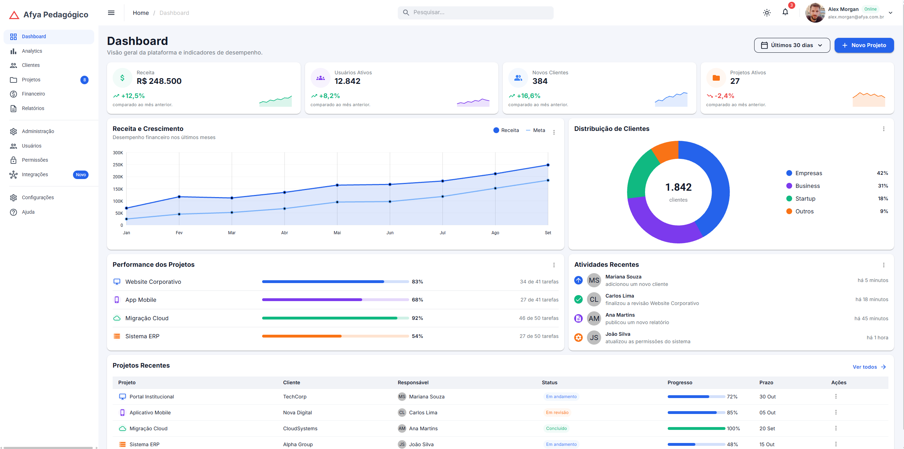
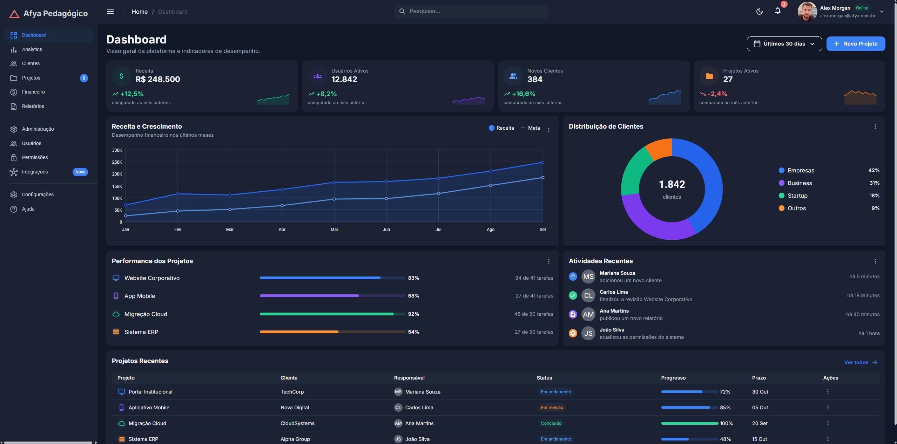
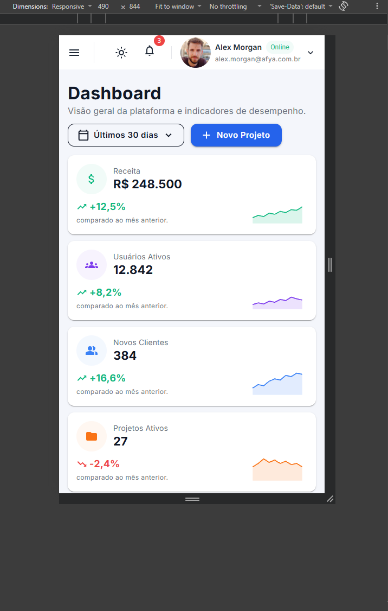
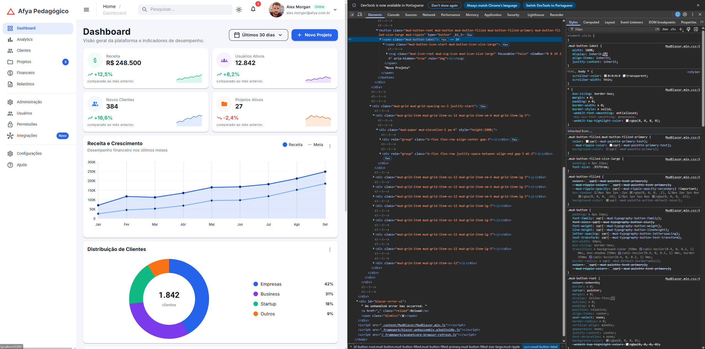

# Afya Admin — Dashboard com Blazor WebAssembly e MudBlazor

## Identificação

| | |
|---|---|
| **Aluno(a)** | WANDERLEI MARQUES FILHO |
| **Matrícula** | 263893 |
| **Faculdade** | Centro Universitário São Lucas |
| **Curso** | Ciência da Computação |
| **Disciplina** | PROGRAMAÇÃO PARA SISTEMAS WEB - CDC.N.3.2026/2.A - 90468 |
| **Professor(a)** | LILUYOUD CURY DE LACERDA |
| **Semestre** | 2026.2 |

## Objetivo do projeto

Este projeto é um painel administrativo (dashboard) para uma plataforma fictícia chamada "Afya Pedagógico". Foi construído com Blazor WebAssembly e a biblioteca de componentes MudBlazor, seguindo um tutorial passo a passo presente no canvas disponibilizado pelo professor.

A página mostra um menu lateral com logo e navegação, uma barra superior com breadcrumb, busca, botão de tema claro/escuro, notificações e menu do usuário, quatro cards de indicadores (KPIs) com mini gráficos de tendência, um gráfico de linha (Receita x Meta), um gráfico de rosca (Distribuição de Clientes), a lista Performance dos Projetos com barras de progresso, o feed de Atividades Recentes e uma tabela de Projetos Recentes.

O objetivo foi praticar a divisão de uma tela em componentes reutilizáveis, o uso de parâmetros, o layout responsivo (celular, tablet e desktop) e a estilização **sem escrever CSS próprio**, usando apenas os componentes, o tema e as classes utilitárias do MudBlazor.

## Tecnologias utilizadas

- .NET 10 / Blazor WebAssembly
- MudBlazor 9
- C# e Razor
- Git e GitHub (branches por etapa e Pull Requests)
- Fonte Inter (Google Fonts)

## Como executar

```bash
git clone https://github.com/wanderleimarques2108-web/afya-admin.git
cd afya-admin
dotnet watch
```

Requer o **.NET SDK 10** (desenvolvido com a versão 10.0.300). O `dotnet watch` mostra no terminal a URL da aplicação (a porta é sorteada); abra essa URL no navegador.

## Telas

### Tema claro


### Tema escuro


### Versão mobile


### HTML gerado (DevTools)



No print inspecionei o botão "Novo Projeto" e o card de KPI. O `MudButton` virou uma tag `<button>` com classes como `mud-button-root`, `mud-button`, `mud-button-filled` e `mud-button-filled-primary`. O `MudPaper` do card virou uma `<div>` com `mud-paper mud-elevation-1 pa-4`, e o `MudStack` virou uma `<div role="group">` com `d-flex flex-row align-center gap-3`. A classe `pa-4` que escrevi em `Class="pa-4"` no código aparece exatamente igual no atributo `class` do HTML final, junto com as classes que o MudBlazor adiciona sozinho.

## Estrutura do projeto


afya-admin/
├── Components/
│   ├── AtividadesRecentes.razor
│   ├── CabecalhoPagina.razor
│   ├── DashboardCard.razor
│   ├── GraficoDistribuicaoClientes.razor
│   ├── GraficoReceita.razor
│   ├── KpiCard.razor
│   ├── PerformanceProjetos.razor
│   ├── ProjetosRecentes.razor
│   ├── SeletorPeriodo.razor
│   └── Ui.cs
├── Data/
│   └── DashboardData.cs
├── Layout/
│   ├── MainLayout.razor
│   └── NavMenu.razor
├── Pages/
│   ├── Dashboard.razor
│   └── NotFound.razor
├── Properties/
│   └── launchSettings.json
├── docs/
│   └── prints/
├── wwwroot/
│   ├── css/app.css
│   ├── img/alex-morgan.jpg
│   └── index.html
├── _Imports.razor
├── App.razor
├── Program.cs
└── afya-admin.csproj


- **`Components/`**: peças visuais reutilizáveis da tela, cada uma recebendo seus dados por parâmetros, mais o `Ui.cs` com duas funções auxiliares de apresentação.
- **`Data/`**: os modelos (records) e os dados fictícios do dashboard (`DashboardData.cs`).
- **`Layout/`**: a "moldura" da aplicação (`MainLayout.razor`, com AppBar, sidebar e tema) e o menu lateral (`NavMenu.razor`).
- **`Pages/`**: as páginas que respondem a uma URL (`Dashboard.razor`, que só monta os componentes, e `NotFound.razor`, da página 404).
- **`wwwroot/`**: arquivos estáticos servidos ao navegador (`index.html`, a foto do usuário e o `app.css` do template, que não foi alterado).
- **`docs/prints/`**: os prints usados neste README.

## Componentes criados

| Componente | Responsabilidade | Parâmetros que recebe |
|---|---|---|
| `DashboardCard` | Card base reutilizável com título, subtítulo, área de ações, menu "⋮" e conteúdo | `Titulo`, `Subtitulo`, `Acoes`, `Menu`, `ChildContent` |
| `CabecalhoPagina` | Título da página com subtítulo e área de botões à direita | `Titulo`, `Subtitulo`, `Acoes` |
| `SeletorPeriodo` | Menu com cara de botão para escolher o período | `Opcoes`, `Valor`, `ValorChanged` |
| `KpiCard` | Card de indicador com ícone, valor, variação e mini gráfico (sparkline) | `Kpi` |
| `GraficoReceita` | Gráfico de linha Receita x Meta | `Meses`, `Receita`, `Meta` |
| `GraficoDistribuicaoClientes` | Gráfico de rosca com o total no centro e legenda própria | `Total`, `Segmentos` |
| `PerformanceProjetos` | Lista de projetos com barras de progresso | `Projetos` |
| `AtividadesRecentes` | Feed de atividades com ícone, avatar de iniciais e horário | `Atividades` |
| `ProjetosRecentes` | Tabela de projetos recentes | `Projetos` |
| `Ui` (classe estática) | Funções `FundoSuave` (fundo pastel da cor) e `Iniciais` (iniciais do nome) | não é componente; recebe uma `Color` ou um nome |

## O que aprendi


**1. Como uma aplicação Blazor WebAssembly inicia no navegador? Qual é o papel do `index.html`, da `<div id="app">` e do `Program.cs`?**

O navegador abre o `wwwroot/index.html`, a única página HTML real do projeto, que tem a `<div id="app">` com uma animação de carregamento. O script `blazor.webassembly.js` baixa o runtime do .NET (em WebAssembly) e as DLLs do projeto, e então o runtime executa o `Program.cs`. Nele, a linha `builder.RootComponents.Add<App>("#app")` manda renderizar o componente `App` dentro da `#app`, o que substitui a animação. O `App.razor` tem o roteador, que olha a URL e escolhe a página com o `@page` correspondente (no meu caso o `Dashboard.razor`), renderizando-a dentro do `MainLayout`. O `AddMudServices()` do `Program.cs` registra os serviços de que os componentes do MudBlazor precisam.

**2. Qual é a diferença entre um Layout, uma Page e um Component neste projeto? Dê um exemplo de cada.**

O Layout é a moldura que envolve todas as páginas, com o ponto `@Body` onde o conteúdo entra; no projeto é o `MainLayout.razor`, que contém a AppBar, o sidebar e o tema. A Page responde a uma URL por ter a diretiva `@page`; o exemplo é o `Dashboard.razor` (`@page "/"`), que apenas monta os componentes. O Component é uma peça reutilizável que recebe dados por parâmetros e não tem rota; o exemplo é o `KpiCard.razor`, que uso quatro vezes, uma para cada indicador.

**3. O que é um `RenderFragment` e como o `DashboardCard` usa esse recurso para ser reutilizado por vários cards?**

Um `RenderFragment` é um parâmetro que recebe um pedaço de marcação (HTML e outros componentes), funcionando como um "buraco" que quem usa o componente preenche. O `DashboardCard` tem a estrutura fixa do card (fundo, título, menu "⋮") e três buracos: `Acoes` (algo à direita do título), `Menu` (itens do menu "⋮", que só aparece se for informado) e `ChildContent` (o conteúdo principal, o que fica entre as tags). Por isso cinco blocos diferentes usam a mesma moldura: o `GraficoReceita` preenche as três partes, enquanto o `AtividadesRecentes` preenche só o `Menu` e o `ChildContent`. Sem isso eu teria de repetir a marcação do card cinco vezes.

**4. Como funciona o `@bind-Valor` no `SeletorPeriodo`? Qual é o papel do `ValorChanged`?**

O Blazor tem uma convenção: se um componente tem um parâmetro `Valor` e um `EventCallback` chamado `ValorChanged`, quem o usa pode escrever `@bind-Valor="variavel"`. Isso passa o valor da variável para dentro do componente e, quando o componente dispara o `ValorChanged`, atualiza a variável de quem o usa. No `SeletorPeriodo`, ao clicar numa opção, o método chama `ValorChanged.InvokeAsync(opcao)`. O componente não altera o próprio `Valor`, só avisa; quem atualiza é a página: no `Dashboard.razor`, `@bind-Valor="_periodo"` guarda a escolha em `_periodo`, e o novo valor volta como parâmetro e muda o texto do botão. O dono do estado é a página.

**5. Por que os dados ficam na pasta `Data`, separados dos componentes? Que vantagem isso traz se, no futuro, os dados vierem de uma API?**

A pasta `Data` responde "o quê mostrar" (números, nomes, cores), no `DashboardData.cs`, e a `Components` responde "como mostrar" (layout, gráficos, tipografia). Os componentes não têm dados escritos neles: recebem tudo por parâmetros, como `Projetos`, `Atividades` e `Segmentos`. Se os dados vierem de uma API, só muda a origem (a página buscaria na API e passaria o resultado), e os componentes continuam iguais, porque não sabem de onde os dados vêm. Também deixa o `Dashboard.razor` curto e fácil de manter.

**6. Como o `MudGrid` com `xs`, `sm` e `lg` faz os cards de KPI se reorganizarem em telas de tamanhos diferentes?**

O `MudGrid` divide a largura em 12 colunas, e cada `MudItem` diz quantas colunas ocupa em cada tamanho de tela; o valor vale "daquele tamanho para cima". Nos KPIs usei `xs="12" sm="6" lg="3"`: no celular (menos de 600px) cada card ocupa 12 colunas, ou seja, um por linha; no tablet (a partir de 600px) ocupa 6, ou seja, dois por linha; no desktop (a partir de 1280px) ocupa 3, ou seja, quatro por linha. Quando a janela muda de tamanho, o grid recalcula sozinho, sem CSS meu.

**7. Como foi possível estilizar a página inteira sem escrever CSS? Explique o papel do tema (`MudTheme`) e das classes utilitárias.**

Usei três ferramentas do MudBlazor. Os parâmetros dos componentes (`Elevation`, `Variant`, `Color`, `Size`, `Typo`) controlam boa parte do visual. O tema (`MudTheme`), no `MainLayout.razor`, concentra as paletas clara e escura, o arredondamento, a altura da AppBar e a fonte Inter; os componentes leem as cores de variáveis CSS geradas a partir dele, então mudar o tema muda tudo junto, e o modo escuro funciona definindo a `PaletteDark` e alternando o `IsDarkMode`. As classes utilitárias, como `pa-4`, `d-flex`, `flex-grow-1`, `align-center`, `mud-text-secondary` e `rounded-lg`, já vêm no `MudBlazor.min.css`. Por isso não criei nenhum `.razor.css` nem mexi no `app.css`.

**8. Por que o namespace do projeto é `afya_admin` e não `afya-admin`?**

O .NET usa o nome do projeto como namespace raiz, mas o hífen não é permitido em identificadores do C#: `afya-admin` seria lido como a subtração "afya menos admin". Por isso o SDK troca o hífen por sublinhado. A pasta, o `.csproj` e o bundle de estilos continuam com hífen, mas no código C# e Razor vale o sublinhado: `using afya_admin;` no `Program.cs` e `@using afya_admin.Layout` no `_Imports.razor`. Ao criar a pasta `Components`, o namespace dela ficou `afya_admin.Components`.

## Dificuldades e soluções


**1. Erro de compilação por código no arquivo errado.** Ao compilar, apareceram 4 erros (`CS1001`, `CS1003`, `CS1002` e `CS1022`) apontando para o início do `DashboardData.cs`. O motivo é que eu tinha colado nele o conteúdo do `Dashboard.razor` (que começa com `@page "/"`), e o compilador C# não entende isso. Resolvi apagando o conteúdo do arquivo e colando o código correto dos dados, começando com `using MudBlazor;`, e depois o build passou sem erros. Aprendi a conferir em qual arquivo estou colando cada trecho.

**2. Trabalho enviado para um branch, mas o `main` do GitHub ficou sem o código.** Eu fiz commit e push em um branch de feature, mas a página principal do repositório (o `main`) só mostrava o commit inicial. Descobri que o GitHub mostra o `main` por padrão e que meu código estava no outro branch. Resolvi integrando o branch ao `main` (merge por Pull Request), e depois passei a trabalhar com um branch por etapa e a integrar cada um por Pull Request.

**3. Sublinhado vermelho no editor mesmo com o código certo.** No `NavMenu.razor`, o VS Code marcava erro nos `MudChip`, mas o código era igual ao do tutorial (com `T="string"`). Rodei `dotnet build` e ele terminou com 0 erros, então o aviso era só o editor desatualizado. Aprendi que o resultado do build é a referência, e que recarregar a janela do editor costuma limpar o aviso.

## Melhorias futuras (opcional)


- **Fazer as outras páginas do menu.** Hoje só o Dashboard existe. Os outros links, como Clientes e Projetos, levam para uma página de erro. criar essas páginas para o menu funcionar completo.
- **Fazer o botão de período mudar os números.** Hoje, quando escolho "Últimos 7 dias", só o texto do botão muda.  futuramente dados reais com os números dos cards também mudassem apresentado os dados corretos de cada periodo.
- **Fazer a busca funcionar.** O campo "Pesquisar..." no topo ainda não faz nadafuturamente filtrar a tabela de Projetos Recentes.
- **Lembrar o tema escolhido.** Quando recarrego a página, ela volta para o tema claro. proxima melhoria seria o navegador lembrar se escolhi o tema escuro ou claro.

